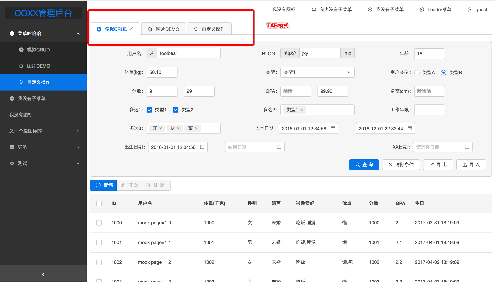

# 关于TAB模式

普通模式下，内容区只会显示一个组件。每次点击侧边栏的菜单项时，正在显示的组件会被替换掉。

TAB模式下，就可以同时显示多个组件了。用户可以在多个组件中切换。

对于TAB模式，我提供了[两个配置项](src/config.js#L18)：

## enable

是否开启tab模式。默认值false。

## allowDuplicate

是否允许同一个组件重复显示。默认值false。

默认情况下，同一个组件只能唯一对应一个tab。点击侧边栏菜单时，如果这个菜单对应的tab已经存在，就会切换过去。但如果allowDuplicate=true，就会新建一个tab。类似“单例vs多实例”的区别。

## 注意事项

tab模式下不会显示面包屑导航，因为没有必要了，tab本身就是一种导航。

tab模式下，切换tab时地址栏url不会变化，所以通过url传参数（比如`/index.html#/option?id=1`这种）的功能有可能会失效。注意只是“有可能”，通过`Link`组件的跳转加的参数一般还是可以生效的，关键在于地址栏是否会变化。

由于tab模式的实现比较特殊，如果自己写的组件想在tab模式下使用，注意不同tab间不要互相干扰，尤其是在allowDuplicate=true时。可以参考DBTable的实现。
